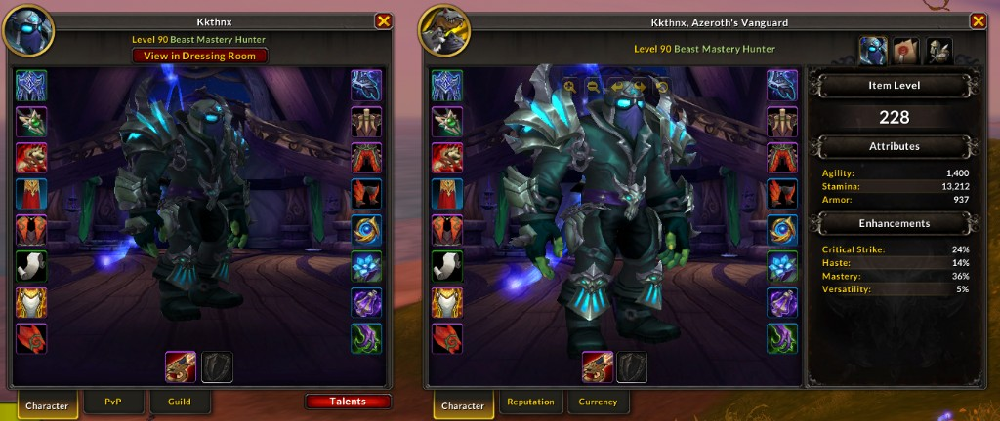

# CharInspectPlus

**A clean, set-and-forget reskin of the Character and Inspect frames — bigger model, tidier item slots, and a class-themed backdrop, with zero configuration.**

---

---

## Overview

The default **Character** and **Inspect** frames waste a lot of space: a small model tucked behind heavy borders, mismatched item-slot sizing, and a plain backdrop. **CharInspectPlus** quietly rebuilds both into something cleaner and more readable — without changing how they work.

It strips the default clutter, lets the character model fill the whole frame, standardizes every equipment slot to a uniform size, and drops in a **class-themed dressing-room background** so each character (and inspect target) feels distinct. The stats panel stays exactly where Blizzard put it, just framed by a tidier layout.

- **Set-and-forget** — no options, no slash commands, no setup. Install it and your frames are better.
- **Both frames covered** — the same polish is applied to your own Character frame *and* the Inspect frame.
- **Combat-safe** — frame resizing is deferred whenever you're in combat, so it never touches a secure frame at the wrong time.
- **Midnight-ready** — built for the current client, with a defensive guard against the 12.0 Secret Values model so inspecting inside instances can't throw errors.
- **Performance-first** — pure event-driven setup that runs once when each frame loads, with globals localized for clean, low-overhead code.

---

## Installation

**Via an addon manager (recommended)**
- [CurseForge](https://www.curseforge.com/wow/addons/charinspectplus) — search for **CharInspectPlus** and install.

**Manual**
1. Download the latest release from the [Releases](https://github.com/Kkthnx-Wow/CharInspectPlus/releases) page.
2. Extract the `CharInspectPlus` folder into `World of Warcraft\_retail_\Interface\AddOns`.
3. Restart the game (or `/reload` if already in-game).

There is nothing to configure — CharInspectPlus applies its layout the moment the Character and Inspect frames load.

---

## Getting Started

Just open your **Character** frame (default hotkey `C`) or **inspect** another player. The enhanced layout is applied automatically. That's the whole workflow — there are no commands to learn and nothing to enable.

---

## Features

### Character Frame
- **Full-size model** — the model scene is expanded to fill the inset, with background, border, and overlay draw layers removed for a clean stage.
- **Uniform item slots** — every equipment button is stripped of its default art and resized to a consistent `37x37`, neatly anchored to the edges of the frame.
- **Class-themed backdrop** — the Paper Doll tab swaps in the dressing-room artwork for your class; other tabs fall back to the standard marble background.
- **Readable item level** — the item-level value is enlarged with a subtle shadow so your iLvl is easy to read at a glance.
- **Tidied titles list** — the Title Manager list has its row backgrounds cleaned up for a flatter, less noisy look.

### Inspect Frame
- **Matching polish** — the same full-size model, uniform slots, and class-themed background applied to inspected players.
- **Smart resizing** — the frame grows for the Paper Doll tab and shrinks back for other tabs, with the backdrop updated to match.
- **Correctly placed talents button** — the talents toggle is re-anchored under the frame and kept at its proper size.

### Built for the Current Client
- **Combat-aware** — any frame resize that would land mid-combat is skipped, since these are secure frames; the layout settles correctly once you leave combat.
- **Secret Value safe** — unit class lookups used for the class backdrop are guarded against Midnight's Secret Values, so inspecting party members inside dungeons and raids stays error-free.

---

## How It Works

1. **Wait** — the Character module hooks `PLAYER_LOGIN`; the Inspect module waits for `Blizzard_InspectUI` to load via `ADDON_LOADED`.
2. **Strip** — default textures, insets, and borders are removed from the model scene and item slots using a lightweight texture-stripping helper.
3. **Re-layout** — the model is expanded to fill the inset, equipment slots are resized and re-anchored, and the stats/talents elements are repositioned.
4. **Theme** — on the Paper Doll tab, the backdrop is set to the class dressing-room art; switching tabs swaps the size and background to suit.

All of this happens through Blizzard-supported hooks (`hooksecurefunc`, `HookScript`) and is gated behind `InCombatLockdown()` so it never fights the secure environment.

---

## Contributing

Contributions, bug reports, and ideas are welcome! Open an [issue](https://github.com/Kkthnx-Wow/CharInspectPlus/issues) or a pull request. When filing a bug, including your client version, the affected frame (Character or Inspect), and a `/reload`-able repro helps a ton.

---

## Support

Appreciate the work that goes into CharInspectPlus? Consider showing your support:

- **PayPal** — [paypal.me/Kkthnx](https://www.paypal.com/paypalme/kkthnx)
- **Patreon** — [patreon.com/Kkthnx](https://www.patreon.com/Kkthnx)
- **Battle.net / Balance** — `Kkthnx#1105` or `JRussell20@gmail.com`
- **In-game gold** — Kkthnx on Area 52 (US)

---

## License

Released under the **MIT License**.

Developed and maintained by **Josh "Kkthnx" Russell**. Built with love for a cleaner character screen.

